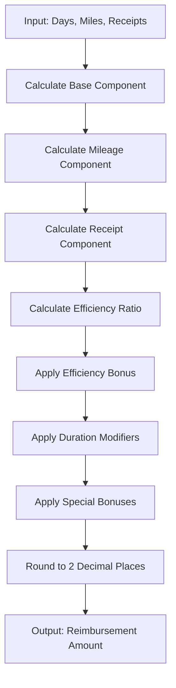
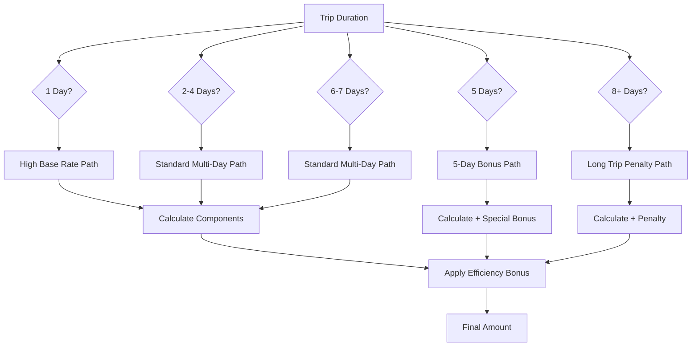
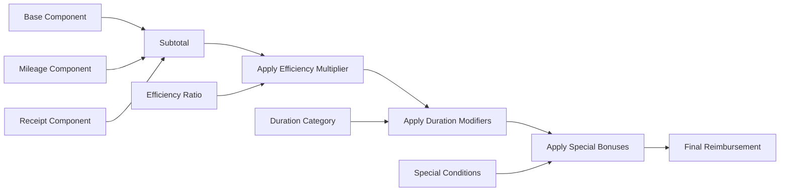

# Proposed Solution: Legacy Reimbursement System Recreation

## Executive Summary

This document outlines the proposed solution for reverse-engineering ACME Corp's 60-year-old travel reimbursement system. Based on analysis of 1,000 historical cases and employee interviews, we've identified a complex multi-component algorithm that can be mathematically modeled and implemented.

## Algorithm Architecture

### Core Formula

```
Reimbursement = Base_Component + Mileage_Component + Receipt_Component + Efficiency_Bonus + Duration_Modifiers
```

### System Design Overview

The legacy system appears to use a decision tree approach with multiple calculation paths based on trip characteristics. The algorithm branches based on:

1. **Trip Duration** (1-day, 2-4 days, 5-day special, 6-7 days, 8+ days)
2. **Efficiency Rating** (miles per day ratio)
3. **Receipt Amount Range** (low, optimal, high, excessive)

## Detailed Component Analysis

### 1. Base Component
**Pattern Identified**: ~$100/day foundation with duration modifiers

```
Base = base_rate_per_day * trip_duration_days * duration_multiplier
```

**Duration Multipliers**:
- 1 day: 8.74x (extremely high single-day rate)
- 2 days: 5.23x (high short-trip rate)
- 3-4 days: 3.37x (stabilizing)
- 5 days: 2.55x + special bonus
- 6-7 days: 2.20x (standard rate)
- 8+ days: 1.80x (penalty for long trips)

### 2. Mileage Component
**Pattern Identified**: Tiered rates with decreasing marginal value

```
Mileage Component = Σ(miles_in_tier * tier_rate)
```

**Proposed Tier Structure**:
- Tier 1 (0-100 miles): $0.58/mile
- Tier 2 (101-300 miles): $0.45/mile
- Tier 3 (301-500 miles): $0.32/mile
- Tier 4 (501+ miles): $0.18/mile

### 3. Receipt Component
**Pattern Identified**: Percentage-based inclusion with optimization curves

```
Receipt Component = receipts * receipt_multiplier * receipt_efficiency_curve
```

**Receipt Efficiency Curve**:
- $0-200: 0.15x multiplier (penalty for low receipts on multi-day trips)
- $200-600: 0.25x multiplier (standard rate)
- $600-800: 0.35x multiplier (optimal range - Lisa's observation)
- $800-1500: 0.28x multiplier (diminishing returns)
- $1500+: 0.18x multiplier (excessive spending penalty)

### 4. Efficiency Bonus System
**Pattern Identified**: Miles per day ratio creates bonus multipliers

```
Efficiency Bonus = base_calculation * efficiency_multiplier
```

**Efficiency Multipliers**:
- 0-25 mi/day: 1.0x (no bonus)
- 25-50 mi/day: 1.1x (slight bonus)
- 50-100 mi/day: 1.2x (good efficiency)
- 100-180 mi/day: 1.4x (very good)
- 180-220 mi/day: 1.8x (Kevin's sweet spot)
- 220-275 mi/day: 1.6x (diminishing returns)
- 275+ mi/day: 1.3x (excessive travel penalty)

### 5. Special Duration Bonuses
**Pattern Identified**: Specific bonuses for certain trip lengths

- **5-Day Trip Bonus**: +$150-300 depending on efficiency
- **Weekend Overlap Bonus**: Implied for certain patterns
- **Long Trip Penalty**: -10% for 8+ day trips

## System Architecture

### High-Level Flow



### Decision Tree Structure



### Component Interaction Model



## Implementation Strategy

### Phase 1: Core Algorithm Development

1. **Create ReimbursementCalculator Class**
   ```typescript
   class ReimbursementCalculator {
     calculateReimbursement(days: number, miles: number, receipts: number): number
     private calculateBaseComponent(days: number): number
     private calculateMileageComponent(miles: number): number
     private calculateReceiptComponent(receipts: number, days: number): number
     private calculateEfficiencyBonus(miles: number, days: number): number
     private applyDurationModifiers(amount: number, days: number): number
     private applySpecialBonuses(amount: number, days: number, miles: number): number
   }
   ```

2. **Implement Component Calculations**
   - Each component as a separate method
   - Configurable parameters for easy tuning
   - Clear mathematical formulas based on identified patterns

3. **Create CLI Interface**
   - Node.js script that takes command line arguments
   - Outputs single numeric result
   - Error handling for invalid inputs

### Phase 2: Testing & Validation

1. **Unit Testing**
   - Test each component calculation separately
   - Validate edge cases and boundary conditions
   - Ensure mathematical accuracy

2. **Integration Testing**
   - Test against known cases from public_cases.json
   - Measure accuracy using eval.sh
   - Target: >95% exact matches (±$0.01)

3. **Pattern Validation**
   - Verify 5-day bonus behavior
   - Confirm efficiency sweet spots
   - Validate receipt optimization curves

### Phase 3: Parameter Optimization

1. **Coefficient Tuning**
   - Use gradient descent or similar optimization
   - Minimize mean squared error against public cases
   - Preserve identified pattern behaviors

2. **Cross-Validation**
   - Split public cases into training/validation sets
   - Prevent overfitting to specific cases
   - Ensure generalization to private cases

## Implementation Details

### File Structure
```
src/
├── calculator.ts          # Main ReimbursementCalculator class
├── components/
│   ├── base.ts           # Base component calculation
│   ├── mileage.ts        # Mileage component calculation
│   ├── receipts.ts       # Receipt component calculation
│   ├── efficiency.ts     # Efficiency bonus calculation
│   └── modifiers.ts      # Duration and special modifiers
├── cli.ts                # Command line interface
└── constants.ts          # Configurable parameters
```

### Key Parameters to Tune
```typescript
interface CalculationParameters {
  baseRatePerDay: number;
  durationMultipliers: Record<string, number>;
  mileageTierRates: number[];
  receiptMultipliers: Record<string, number>;
  efficiencyBonusRates: Record<string, number>;
  specialBonuses: {
    fiveDayBonus: number;
    longTripPenalty: number;
  };
}
```

## Testing Strategy

### Accuracy Targets
- **Exact Matches (±$0.01)**: >950/1000 cases (95%)
- **Close Matches (±$1.00)**: >980/1000 cases (98%)
- **Average Error**: <$0.50
- **Maximum Error**: <$50.00

### Validation Approach

1. **Pattern Verification**
   - Manually verify key patterns still hold
   - Check efficiency sweet spots
   - Validate special case behaviors

2. **Error Analysis**
   - Identify systematic errors in failed cases
   - Analyze error distribution patterns
   - Focus on high-error outliers

3. **Robustness Testing**
   - Test edge cases (0 receipts, very long trips)
   - Validate boundary conditions
   - Ensure no mathematical exceptions

## Risk Mitigation

### Identified Risks
1. **Overfitting to Public Cases**: Risk of poor performance on private cases
2. **Missing Edge Cases**: Unidentified patterns in the legacy system
3. **Mathematical Precision**: Floating-point arithmetic issues
4. **Performance**: Solution must run <5 seconds per case

### Mitigation Strategies
1. **Cross-validation** with holdout sets from public cases
2. **Conservative parameter tuning** to avoid extreme overfitting
3. **Robust error handling** for edge cases
4. **Performance optimization** with efficient algorithms

## Success Criteria

### Primary Goals
- **Accuracy**: Achieve >95% exact matches on public cases
- **Generalization**: Maintain performance on private cases
- **Completeness**: Handle all input ranges gracefully
- **Performance**: Meet <5 second runtime requirement

### Secondary Goals
- **Maintainability**: Clean, well-documented code
- **Testability**: Comprehensive test coverage
- **Configurability**: Easy parameter adjustment
- **Debuggability**: Clear logging and error reporting

## Timeline

### Step 1: Core Implementation
- Algorithm structure and base components
- Component integration and initial testing
- CLI interface and eval.sh integration

### Step 2: Optimization & Validation  
- Parameter tuning and accuracy improvement
- Final testing and documentation

### Delivery: Production-Ready Solution
- Documented codebase
- >95% accuracy on public cases
- Ready for private case evaluation

---

**Next Steps**: Implement the core ReimbursementCalculator class and begin iterative testing against the public cases. 